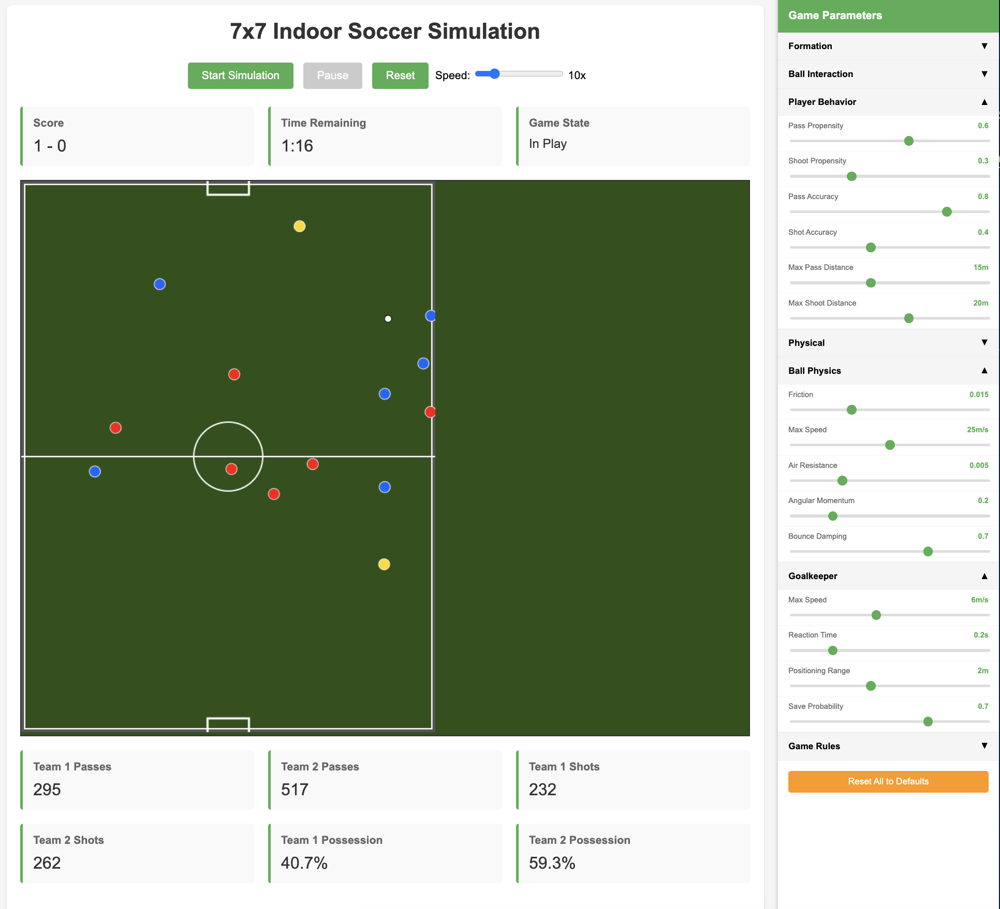

# ⚽ SoccerSim - 7x7 Indoor Soccer Simulation

A physics-based soccer simulation with realistic player behavior, ball physics, and team dynamics.

## 🎮 Live Demo

**[Play the simulation →](https://soccersim.up.railway.app/)**

## 📸 Screenshot



## 🚀 Features

- Real-time 7v7 soccer simulation
- Realistic physics engine for ball movement and player interactions
- Multiple formation options (Diamond, Wide Diamond, Box, Triangle, etc.)
- Adjustable game parameters (speed, aggression, passing, shooting)
- Live statistics tracking (possession, passes, shots, score)
- Interactive web interface with playback controls

## 🛠️ Technology Stack

- **Backend**: Python, Flask
- **Physics**: NumPy for realistic ball and player dynamics
- **Visualization**: Plotly.js for interactive field rendering
- **Database**: SQLite for game history
- **Deployment**: Railway

## 📁 Project Structure

```
soccerSim/
├── app.py              # Flask web application
├── simulator.py        # Game simulation engine
├── game.py            # Game logic and state management
├── player.py          # Player AI and behavior
├── physics.py         # Ball physics and collisions
├── formation.py       # Team formations
├── config.py          # Game parameters
├── optimization/      # Parameter optimization tools
├── tests/             # Test files
├── docs/              # Documentation
└── data/              # Saved configs and results
```

## 🏃‍♂️ Running Locally

1. Clone the repository:
```bash
git clone https://github.com/kylemath/soccerSim.git
cd soccerSim
```

2. Set up virtual environment:
```bash
python -m venv venv
source venv/bin/activate  # On Windows: venv\Scripts\activate
```

3. Install dependencies:
```bash
pip install -r requirements.txt
```

4. Run the application:
```bash
python app.py
```

5. Open your browser to `http://localhost:5000`

## 🎯 How It Works

The simulation models realistic soccer gameplay with:
- **Player AI**: Context-aware decision making (passing, shooting, defending)
- **Physics Engine**: Ball trajectory, friction, collisions, and out-of-bounds detection
- **Formations**: Tactical positioning for different playing styles
- **Game Rules**: Goals, restarts, possession changes, and time management

## 📊 Optimization Tools

Included optimization tools allow you to:
- Find optimal parameters for different play styles
- Batch test multiple configurations
- Visualize parameter effects on game outcomes
- Save and compare configurations

See the `optimization/` folder for advanced tuning capabilities.

## 📄 License

MIT License - feel free to use and modify!

## 👤 Author

Kyle Mathewson - [@kylemath](https://github.com/kylemath)

---

**[Try the live simulation →](https://soccersim.up.railway.app/)**

